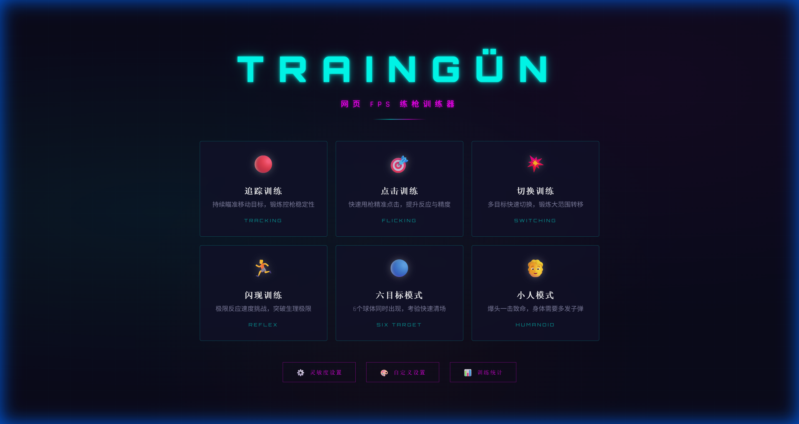

<p align="center">
  <h1 align="center">🎯 TRAINGÜN</h1>
  <p align="center">
    <b>开源网页 FPS 练枪训练器</b><br>
    <i>像 KovaaK's 一样专业，打开浏览器就能练</i>
  </p>
  <p align="center">
    
    
    
    
  </p>
</p>

<p align="center">
  
</p>

---

## 🔥 为什么选择 TRAINGÜN？

> **你不需要花 ¥72 买 KovaaK's，也不需要下载 200MB 的 Aim Lab。**
>
> TRAINGÜN 是一个**完全免费、开源、纯前端**的网页 FPS 练枪训练器。打开浏览器就能练，零安装、零门槛。它拥有赛博朋克级别的视觉体验、6 种专业训练模式、精准的灵敏度同步系统，以及完整的成绩追踪功能。
>
> **无论你玩 CS2、Valorant 还是 Apex，这里都能用相同的手感高效练枪。**

---

## ✨ 功能亮点

### 🎮 6 种训练模式

| 模式 | 说明 | 训练目标 |
|------|------|----------|
| 🔴 **追踪训练** | 持续瞄准移动目标 | 控枪稳定性、微调能力 |
| 🎯 **点击训练** | 快速甩枪精准点击 | 反应速度、甩枪精度 |
| 💥 **切换训练** | 多目标快速切换 | 大范围转移、目标切换 |
| 🏃 **闪现训练** | 极限反应速度挑战 | 反应极限、注意力 |
| 🔵 **六目标模式** | 6 个球体同时出现 | 快速清场、全局意识 |
| 🧑 **小人模式** | 爆头一击毙命 | 爆头率、精确瞄准 |

### 🎱 3D 球体目标
- 带有**渐变高光**的 3D 球体效果
- 自定义球体**颜色**（8 种预设 + 自由选取）
- 自定义球体**透明度**
- 实时预览效果

### 🧑 小人目标系统
- 🎯 **头部** → 一击毙命，300 分
- 🫁 **身体** → 需要 2-4 发子弹（按难度）
- ❤️ 实时 **HP 血条**显示
- 💀 **爆头特效**（HEADSHOT! 文字 + 红色粒子爆炸）

### ⊕ 完全自定义准星
- 4 种样式：十字 / 十字+圆点 / 纯圆点 / 圆圈
- 自定义颜色、大小、间距、粗细、透明度
- 实时 Canvas 预览

### 🔧 游戏灵敏度同步
将你游戏里的灵敏度精确转换到 TRAINGÜN，支持：
- **CS2** / **Valorant** / **Apex Legends**
- **Overwatch 2** / **Fortnite** / **Rainbow Six Siege**
- 自动计算 **cm/360** 和网页灵敏度系数

### 📊 成绩追踪与统计
- 各模式**最高分** / **平均分** / **命中率**
- 最近 30 天**成绩趋势折线图**
- 历史记录查看
- **NEW RECORD** 新纪录提醒

### 🎨 赛博朋克暗黑主题
- 霓虹配色（青色 + 品红 + 橙色）
- 动态网格背景 + 光晕效果
- Logo 闪烁动画
- 粒子爆炸 / 浮动文字 / 得分滚动动画

### 🔫 进阶武器系统
- 4 种预设武器：**Standard** (激光), **Vandal** (步枪), **Sheriff** (手枪), **Operator** (狙击)
- 真实后坐力模拟 (垂直上跳 + 水平抖动)
- **ADS 开镜系统** (右键瞄准)
- 换弹机制 (按 R 换弹)
- 武器切换 (按 1-4 数字键)

### � 深度数据分析
- **射击热力图**：结算界面展示弹着点分布 (Hit/Miss)
- 反应时间统计与爆头率分析

### ⚡ 沉浸式反馈
- 动态屏幕震动 (Screen Shake)
- Web Audio API 合成音效系统 (射击、命中、爆头、击杀)
- 粒子特效优化

---

## �🚀 快速开始

### 方法一：在线体验（推荐）

> 🔗 部署后这里放你的在线地址

### 方法二：本地运行

```bash
# 1. 克隆仓库
git clone https://github.com/lby-1/trainGun.git
cd trainGun

# 2. 启动本地服务器（任选一种）
npx serve . -l 3030
# 或者
python -m http.server 3030

# 3. 打开浏览器
# 访问 http://localhost:3030
```

> ⚠️ **注意：** 由于使用了 ES Module，不能直接双击 `index.html` 打开，必须通过 HTTP 服务器访问。

### 方法三：Docker 部署

**一键启动（推荐）：**

```bash
# 克隆仓库
git clone https://github.com/lby-1/trainGun.git
cd trainGun

# 使用 Docker Compose 启动
docker compose up -d

# 访问 http://localhost:3030
```

**手动构建：**

```bash
# 构建镜像
docker build -t traingun .

# 运行容器
docker run -d --name traingun -p 3030:80 traingun

# 访问 http://localhost:3030
```

**停止和清理：**

```bash
# Docker Compose 方式
docker compose down

# 手动方式
docker stop traingun && docker rm traingun
```

> 💡 **容器特性：** 基于 `nginx:alpine` 轻量镜像（~40MB），内置 Gzip 压缩、安全响应头、静态资源缓存策略和健康检查。

---

## 🎮 操作说明

| 操作 | 按键 |
|------|------|
| 瞄准 | 鼠标移动 |
| 射击 | 鼠标左键 |
| 开镜 (ADS) | 鼠标右键 |
| 切换武器 | 数字键 `1-4` |
| 换弹 | `R` |
| 暂停 | `ESC` |
| 重新开始 | `R` (暂停菜单中) / 界面按钮 |
| 返回菜单 | 暂停后按 `ESC` |

---

## 🏗️ 技术架构

```
trainGun/
├── index.html              # 主页面 (SPA)
├── css/
│   └── style.css           # 赛博朋克主题样式
├── js/
│   ├── app.js              # 应用入口 & 路由
│   ├── engine.js           # 游戏引擎核心
│   ├── weapon.js           # 武器系统 & 后坐力逻辑
│   ├── audio.js            # 音频管理器 (Web Audio API)
│   ├── sensitivity.js      # 灵敏度计算引擎
│   ├── storage.js          # localStorage 数据持久化
│   ├── ui.js               # UI 组件
│   ├── stats.js            # 统计面板 & 折线图
│   └── modes/
│       ├── tracking.js     # 追踪模式
│       ├── flicking.js     # 点击模式
│       ├── switching.js    # 切换模式
│       ├── reflex.js       # 闪现模式
│       ├── sixtarget.js    # 六目标模式
│       └── humanoid.js     # 小人模式
└── README.md
```

### 技术栈

- **HTML5 Canvas 2D** — 游戏渲染引擎
- **Vanilla JavaScript (ES6+)** — 零依赖，纯原生
- **CSS3** — 赛博朋克动画与设计系统
- **Pointer Lock API** — FPS 级鼠标控制
- **localStorage** — 离线数据持久化
- **Google Fonts** — Orbitron + Rajdhani 字体

> **零框架、零依赖、零构建工具** — 打开就跑

---

## 📸 界面预览

### 主界面

<p align="center">
  
</p>

> 赛博朋克暗黑风主界面，6 种训练模式一览，底部提供灵敏度设置、自定义设置和训练统计入口。

---

## 🤝 贡献

欢迎提交 Issues 和 Pull Requests！

```bash
# Fork 本仓库
# 创建特性分支
git checkout -b feature/amazing-feature
# 提交改动
git commit -m 'Add amazing feature'
# 推送分支
git push origin feature/amazing-feature
# 创建 Pull Request
```

---

## 📄 License

本项目采用 [MIT License](LICENSE) 开源协议。

---

## 🌟 Star History

如果这个项目对你有帮助，请给一个 ⭐ Star！

---

<p align="center">
  <b>🎯 TRAINGÜN</b> — 打开浏览器，开始练枪<br>
  <i>Built with ❤️ and pure JavaScript</i>
</p>
